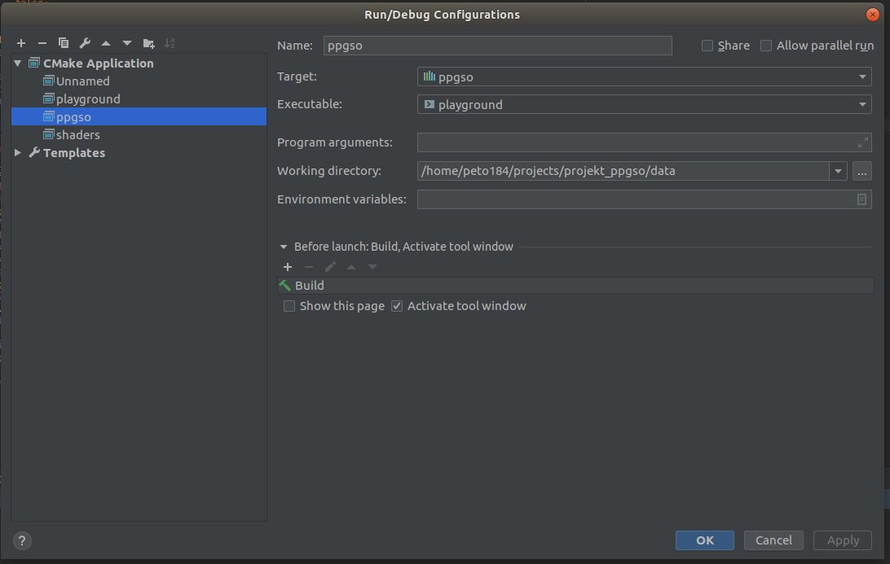

# PPGSO Project - Supermario 

School project for computer graphics subject (2017).
Very raw recreation of supermario in opengl 3.2.

Story follows the main protagonist, who is a 'psychic duck', which shoots colorful balloons against his lifelong immovable santa claus enemies. 

# Preview:
This is level 1. Game consists of 3 levels, then gracefully crashes :). 


# Installation

Project is set up to run in CLion IDE on Linux.

```bash
# Linux dependencies
sudo apt-get install build-essential cmake libglew-dev libglfw3-dev libglm-dev
```
Afterwards set your build configuration as follows.



